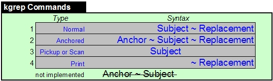

##This is kgrep, as in Kevin's grep.

A command line tool to search, replace, extract and/or print text based on regular expressions from stdin or input file(s). All output is written to stdout. Kgrep uses .NET regex syntax.

Project Goals
-------------

* Refactor a working but untestable program into a testable program with unit tests, small methods, classes, etc. In other words, a sandbox to play, experiment and have a useful tool at the end of the day.
* Developed using VS2012 & .NET 4.5, Nunit for testing and NSubstitute for mocking. 

Binaries
-----
To try kgrep, the binaries are in the *deploy* folder. You must also have .net 4.0 installed.

Usage
-----

    kgrep matchpattern filename...filenameN
    cat filename(s) | kgrep matchpattern
    
    where matchpattern = Replacement | ScanToken
        Replacement = ReplacementFilename | ReplacementCommand
           ReplacementCommand = a string with syntax "anchor~before~after" where "anchor~" is optional. 
           ReplacementFilename is a file containing a ReplacementCommand per line.

        ScanToken =  a regex string that when found in input will print one match per line
		filenames are expanded using normal wild card notation

Kgrep runs in two modes: A Scanner and Print OR a Search and Replace tool. 

####Scan Mode
It runs as a scanner if the command file (or replacements given on the command line) only contain *Scan* commands, i.e. type 3 in the chart above. All matched commands are printed to stdout. Example: *kgrep "[0-9]+" test.txt* will print all numbers found in test.txt on a separate line.

####Search and Replacement Mode
It runs in search mode if the file contains commands other than just *Scan* commands. it will search and replace *Subject* with *Replacement* and print the results to stdout. Unlike grep, all named and unnamed captures are remembered during the run and can be applied to any field in a command (except *Anchor*). Such expressions are called Pickups. Syntax for a named capture is normal regex *(?&lt;name&gt;[a-z]+)* OR the special {name} syntax where *name* is the pickup's name that holds the matched value. {name} matches anything where it has been placed. The value of this matched expression can be retrieved using ${name} syntax. If no Commands match an input line, the input line will print to stdout unchanged.

---
##kgrep commands explained

### Normal
Replace all occurrences of *Subject* with *Replacement*. *Subject* can contain  named matches, unnamed matches and Pickups. *Replacement* can contain Pickups.

### Anchored 
Anchored is the same as a Normal command except it is only applied to lines that match *Anchor*. *Anchor* can contain named and unnamed matches however the matched values are not held, i.e. value is not available for later Pickup use. *Anchor* cannot contain Pickups.

### Pickup or Scan 
If in scanner mode, all matched *Subject* are printed to stdout on separate lines. Only the matching pattern is printed. Characters not matched are ignored. Before printing to stdout, all matches on a given line are concatenated together using the value in the ScannerFS string and printed on a separate line. *Subject* can be placed in a file but usually it is given on the command line. Note: Currently you cannot scan a text string for the field delimiter. Use the Control Option ScannerFS to control the characters that are placed between each matched token.

Example: 

    echo "hello dolly bob"|kgrep "[ld]o" 
   will print (writes matching patterns on separate lines)

    lo
    do

If in search mode, any matches are treated as Pickups for later reference. *Subject* can contain Pickups. See Pickup explanation below.

## CommandFile
Commands can be consolidated into a *CommandFile*. 

Commands can be stacked as one string and supplied on the command line or stored in a file and given as the first argument on the command line. Commands are stacked using the ";" stacking character, e.g. "dog~cat; h(..)~cold" contains two Normal Commands. The stacking character cannot be overridden. 

The *CommandFile* can contain any of the kgrep commands in any order.  

Other than memory, there is no limit to the number of Commands that can be in a CommandFile or command line. Commands are processed in the order given. See SampleReplacementFile.txt for examples of *ReplacementCommands* in a file. 

Leading and trailing spaces are removed from these fields. If you want to include leading or trailing spaces, enclose the string in double quotes, i.e. " world ". The enclosing double quotes will not be included as part of the search field but the blanks will be included.
 
If supplied and is not found in a line, the "before~after" replacement will **not** be applied.

    Some examples:    
    echo "Billy"|kgrep "(B|i)~"               # prints "iy" by removing all "B" and "i"s
    echo "Billy"|kgrep "(.) ~ $1-"            # prints "B-i-l-l-y-" 
    echo "hello dolly bob"|kgrep "[ld]o~hi"   # prints "helhi hilly bob"
    echo "careful here"|kgrep "ere~ful~fully" # prints "carefully here"
    echo "careful here"|kgrep "abc~ful~fully" # "abc" not found, prints ""
    echo "cat dog"|kgrep "(.?) (.?) ~ $2 $1"  # prints "dog cat"
    echo "[aA]b~B; Hello~bye"|kgrep "Hello Abe" # prints "Bye Be" Note the stacked ReplacementCommands
    echo "delim=,; a,b; g,f"|kgrep "abcdefg"  # prints "bbcdeff"
    echo "comment='; 'ignored;"|kgrep "abc"   # prints ""  because no delim present so interpreted as a SearchToken
    echo "#~; comment='; 'ignored;"|kgrep "abc"   # prints "abc" because argument is now interpreted as a ReplacementCommand

**CommandFile Control Options**

The following controls can be embedded anywhere in the CommandFile. Control options are not case sensitive but must be at the beginning of a line. Control Options are no case sensitive but there values are case sensitive when applied to a line. There is no separate config file.

- **delim=?** where ? represents a single or a series of character enclosed in optional quotes. Its value is the new delimiter. This value separates the CommandFile fields. Default is "~".

- **comment=?** This value designates the beginning of a comment. Default is "#".

- **ScannerFS=?** Only used in Scanner mode. The scanned tokens are "glued" together with the value of this option. Default is "\n".

Caution: You can get unexpected results if you are not careful when using Control Options. For example, setting comment=~ still allows default delim=~ so the Command "comment=~; a~b" is interpreted as a Normal Command but becomes just "a" since "~b" is now a comment and the expected replacement doesn't take effect. No change occurs to the source inputs.

**Pickups**

Pickups add a lot of flexibility to kgrep.

Use ${name} syntax *where name is 1..9 to reference an unnamed capture or the name given to a named capture*, to retrieve the last value of a given capture whether the capture was from the current line or a prior line. Example: The string "hello (?&lt;word&gt;[a-z]+)" contains a pickup named "word". {pickup} is a alternate and simpler syntax.

Pickup values are kept for the duration of the run and can only be used in *ReplacementStrings*.  A named pickup's value is the value of the last capture. 

Example of Pickup, hold and print:
  
    Given these ReplacementCommands:
    (?<lowerword>[a-z]+)
    <tag id=(?<idpickup>[a-zA-Z]+)> ~ ${idpickup} ${lowerword}

    And this input:
    <tag id=hi> today

    While send to stdout:
    hi tag    # idpickup="hi"; lowerword="tag"

    
Example of replacing with repeating pickup:
   
    Given these ReplacementCommands:
    ^{name}~c${name}${name}

    And this input:
    a

    Will send to stdout:
    caa      

